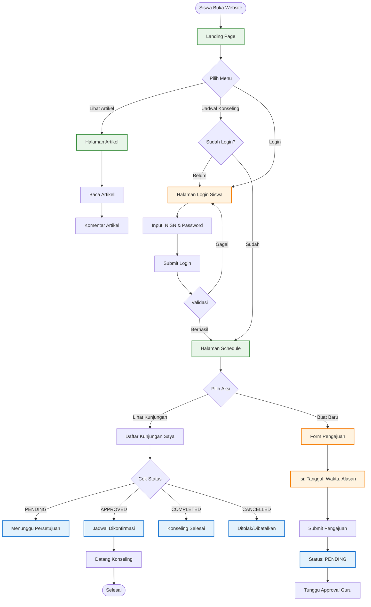
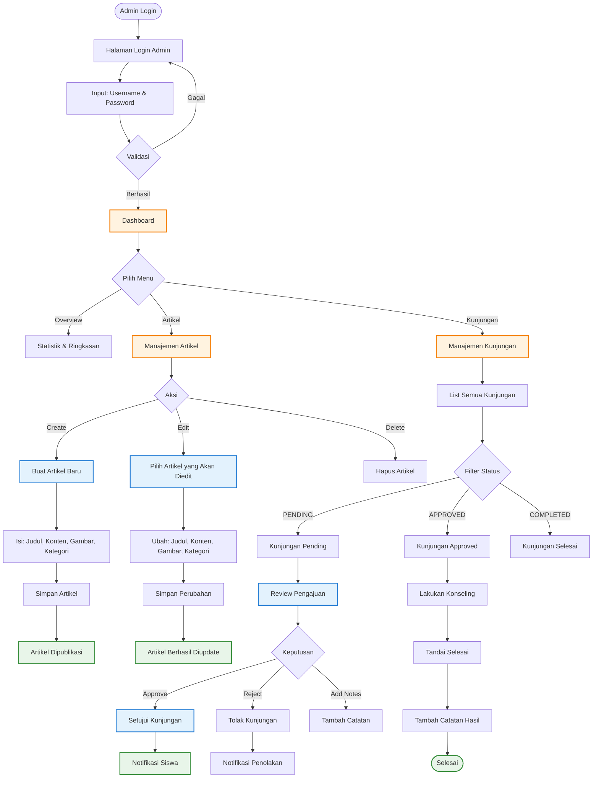
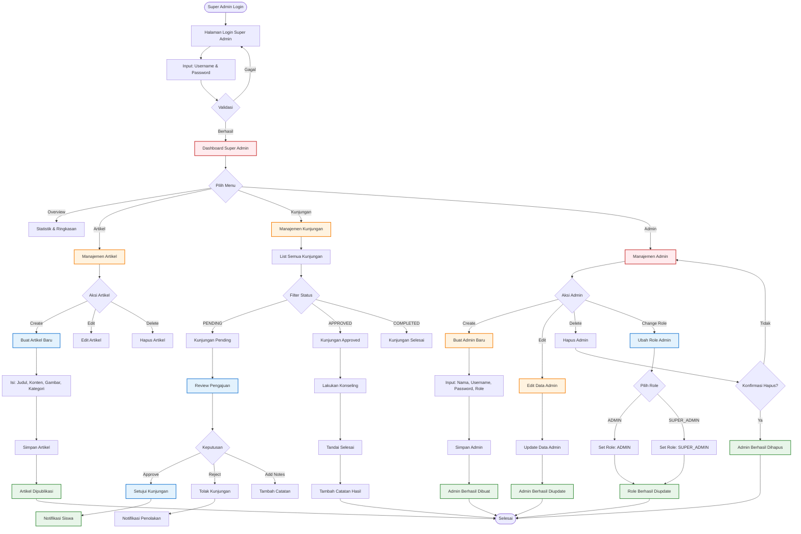

# Flowchart Aplikasi Sistem Bimbingan dan Konseling (Sahabat BK)

## 1. Flowchart Siswa/Murid

---

## 2. Flowchart Admin (Guru BK)

---

## 3. Flowchart Super Admin

---

## Keterangan

### Status Kunjungan
- **PENDING**: Menunggu review dari guru BK
- **APPROVED**: Disetujui, jadwal dikonfirmasi
- **COMPLETED**: Sesi konseling selesai
- **CANCELLED**: Ditolak atau dibatalkan

### Role Admin
- **ADMIN**: Guru BK biasa - Akses kelola artikel & kunjungan
- **SUPER_ADMIN**: Guru BK Senior - Akses penuh termasuk kelola admin

### Perbedaan Admin vs Super Admin
| Fitur | Admin | Super Admin |
|-------|-------|-------------|
| Manajemen Artikel | ✅ | ✅ |
| Manajemen Kunjungan | ✅ | ✅ |
| Statistik & Overview | ✅ | ✅ |
| Manajemen Admin | ❌ | ✅ |
| Ubah Role Admin | ❌ | ✅ |

### Alur Singkat
1. **Siswa**: Login → Lihat Artikel → Buat Jadwal Konseling → Tunggu Approval → Konseling
2. **Admin**: Login → Kelola Artikel → Review & Approve Kunjungan → Konseling → Buat Catatan
3. **Super Admin**: Login → Semua Fitur Admin + Kelola Data Admin & Role

### Catatan Penting
- Akun siswa dibuat oleh Admin/Super Admin melalui sistem, siswa hanya perlu login dengan NISN yang telah diberikan
