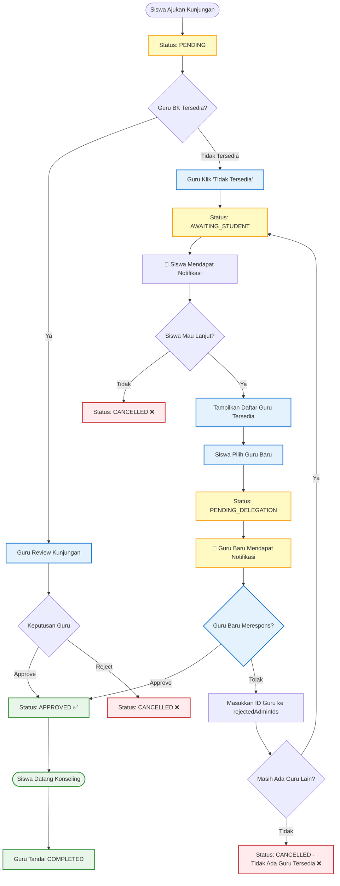

# 🔄 Instruksi Perubahan Alur Delegasi Kunjungan (Visit Delegation Flow)

## 📋 Ringkasan Perubahan

Alur lama mengharuskan guru BK mendelegasikan kunjungan **melalui Super Admin**. Alur baru menghapus ketergantungan tersebut — siswa kini **dilibatkan secara langsung** dalam proses delegasi jika guru yang dituju tidak tersedia.

---

## ❌ Alur LAMA (Sebelum Perubahan)

```
Siswa Ajukan Kunjungan
    → Guru BK Tidak Bisa
        → Guru BK Lapor ke Super Admin
            → Super Admin Delegasikan ke Guru Lain
                → Guru Lain Review & Approve
```

**Masalah:**
- Super Admin jadi bottleneck dalam proses delegasi
- Siswa tidak punya kontrol atau transparansi
- Proses lambat karena harus melewati banyak pihak

---

## ✅ Alur BARU (Setelah Perubahan)

```
Siswa Ajukan Kunjungan
    → Guru BK Tidak Tersedia
        → Siswa Mendapat Notifikasi
            → Siswa Memilih: Lanjut atau Batal?
                ├── Batal → Kunjungan dibatalkan (CANCELLED)
                └── Lanjut → Siswa Pilih Guru Lain
                                → Guru Menerima Notifikasi
                                    ├── Guru Approve → APPROVED ✅
                                    └── Guru Tolak
                                            → Siswa Pilih Guru Lain
                                            (Guru yang sudah menolak tidak tampil)
                                                → [Ulangi sampai ada yang Approve
                                                   atau tidak ada guru tersisa]
```

---

## 🗄️ Perubahan Database Schema

### Tambahan pada model `Visit` (prisma/schema.prisma)

```prisma
model Visit {
  id             String      @id @default(cuid())
  studentId      String
  student        Student     @relation(fields: [studentId], references: [id])

  // --- FIELD BARU ---
  assignedAdminId  String?   // Guru BK yang saat ini ditugaskan
  assignedAdmin    Admin?    @relation("AssignedVisits", fields: [assignedAdminId], references: [id])
  rejectedAdminIds String[]  // Daftar ID guru yang sudah menolak (array)
  delegationStep   Int       @default(0)  // Langkah delegasi ke-berapa
  // ------------------

  date           DateTime
  time           String
  reason         String
  status         VisitStatus @default(PENDING)
  notes          String?
  createdAt      DateTime    @default(now())
  updatedAt      DateTime    @updatedAt
}
```

### Tambahan Enum Status Kunjungan

```prisma
enum VisitStatus {
  PENDING               // Menunggu review guru BK
  AWAITING_STUDENT      // Menunggu keputusan siswa (guru tidak tersedia)
  PENDING_DELEGATION    // Siswa memilih lanjut, menunggu konfirmasi guru baru
  APPROVED              // Disetujui
  COMPLETED             // Konseling selesai
  CANCELLED             // Dibatalkan
}
```

---

## 🔌 Perubahan API Endpoints

### Endpoint Baru

| Method | Endpoint | Deskripsi | Aktor |
|--------|----------|-----------|-------|
| `POST` | `/api/visits/[id]/unavailable` | Guru BK tandai diri tidak tersedia | Admin |
| `POST` | `/api/visits/[id]/student-decision` | Siswa putuskan lanjut atau batal | Siswa |
| `POST` | `/api/visits/[id]/delegate` | Siswa pilih guru baru | Siswa |
| `GET`  | `/api/admins/available` | Ambil daftar guru yang belum menolak kunjungan ini | Siswa |
| `POST` | `/api/visits/[id]/teacher-response` | Guru baru terima atau tolak delegasi | Admin |

### Modifikasi Endpoint Lama

| Endpoint | Perubahan |
|----------|-----------|
| `PUT /api/visits/[id]` | Tambahkan handling untuk status `AWAITING_STUDENT` dan `PENDING_DELEGATION` |

---

## 🖥️ Perubahan Frontend

### 1. Halaman Siswa (`/schedule` — `app/schedule/page.tsx`)

#### a. Komponen Notifikasi Status `AWAITING_STUDENT`

Ketika status kunjungan adalah `AWAITING_STUDENT`, tampilkan **modal/alert notifikasi** kepada siswa:

```
┌────────────────────────────────────────────────────────┐
│  ⚠️  Guru BK [Nama Guru] Sedang Tidak Tersedia        │
│                                                        │
│  Apakah kamu ingin melanjutkan pengajuan               │
│  kunjungan dengan guru BK lain?                        │
│                                                        │
│       [  Batalkan Kunjungan  ]  [  Ya, Lanjutkan  ]   │
└────────────────────────────────────────────────────────┘
```

**Aksi:**
- **Batalkan** → `POST /api/visits/[id]/student-decision` dengan body `{ decision: "cancel" }` → status jadi `CANCELLED`
- **Ya, Lanjutkan** → Muncul daftar guru lain → status jadi `PENDING_DELEGATION`

#### b. Komponen Pemilihan Guru (`TeacherSelectionModal`)

Setelah siswa pilih "Lanjutkan", tampilkan modal daftar guru yang tersedia:

```
┌────────────────────────────────────────────────────────┐
│  👩‍🏫 Pilih Guru BK Lain                               │
│                                                        │
│  ○ Budi Santoso, S.Pd                                 │
│  ○ Rina Marlina, M.Psi                                │
│  ○ Ahmad Fauzi, S.Pd                                  │
│                                                        │
│  (Guru yang sudah menolak tidak ditampilkan)          │
│                                                        │
│              [  Pilih Guru  ]                          │
└────────────────────────────────────────────────────────┘
```

> [!NOTE]
> Panggil `GET /api/admins/available?visitId=[id]` untuk mendapatkan daftar guru yang belum ada di `rejectedAdminIds` kunjungan tersebut.

#### c. Tampilan Status Baru di Daftar Kunjungan

| Status | Label UI | Warna | Keterangan |
|--------|----------|-------|------------|
| `AWAITING_STUDENT` | ⏳ Menunggu Keputusanmu | Kuning | Guru tidak tersedia, menunggu pilihan siswa |
| `PENDING_DELEGATION` | 🔄 Menunggu Konfirmasi Guru | Biru | Siswa sudah pilih guru, menunggu respon guru |

---

### 2. Dashboard Admin/Guru BK (`/dashboard`)

#### a. Tombol "Tandai Tidak Tersedia" pada kunjungan PENDING

Ketika guru BK membuka detail kunjungan dengan status `PENDING`, tambahkan tombol baru:

```
┌──────────────────────────────────┐
│  Kunjungan dari: Andi Pratama   │
│  Alasan: Permasalahan keluarga  │
│                                  │
│  [ ✅ Approve ]  [ ❌ Reject ]  │
│  [ ⚠️ Tidak Tersedia ]          │
└──────────────────────────────────┘
```

**Aksi "Tidak Tersedia":**
- `POST /api/visits/[id]/unavailable`
- Status kunjungan berubah ke `AWAITING_STUDENT`
- Siswa mendapat notifikasi (via polling atau websocket/SSE)

#### b. Notifikasi Delegasi Masuk untuk Guru Baru

Ketika guru baru dipilih oleh siswa (status `PENDING_DELEGATION` dengan `assignedAdminId` mengarah ke guru ini), tampilkan notifikasi di dashboard:

```
┌──────────────────────────────────────────────────────┐
│  📩 Permintaan Delegasi Kunjungan                   │
│                                                      │
│  Siswa: Andi Pratama (XII IPA 1)                    │
│  Alasan: Permasalahan keluarga                      │
│  Jadwal: 10 April 2026, 09.00 WIB                  │
│                                                      │
│       [  ❌ Tolak  ]   [  ✅ Terima  ]              │
└──────────────────────────────────────────────────────┘
```

**Aksi:**
- **Terima** → `POST /api/visits/[id]/teacher-response` dengan `{ response: "approve" }` → status `APPROVED`
- **Tolak** → `POST /api/visits/[id]/teacher-response` dengan `{ response: "reject" }` → ID guru masuk ke `rejectedAdminIds`, status kembali ke `AWAITING_STUDENT` untuk siswa memilih ulang

---

## 🔄 Flowchart Alur Baru



---

## 📋 Langkah Implementasi

### Fase 1 — Database & Backend

- [x] Update `prisma/schema.prisma`:
  - Tambah field `assignedAdminId`, `rejectedAdminIds`, `delegationStep` ke model `Visit`
  - Tambah nilai enum `AWAITING_STUDENT`, `PENDING_DELEGATION` ke `VisitStatus`
- [x] Buat migration: `npx prisma db push`
- [x] Buat API route `POST /api/visits/[id]/unavailable`
- [x] Buat API route `POST /api/visits/[id]/student-decision`
- [x] Buat API route `POST /api/visits/[id]/delegate`
- [x] Buat API route `POST /api/visits/[id]/teacher-response`
- [x] Buat API route `GET /api/admins/available?visitId=[id]` (filter guru yang belum di `rejectedAdminIds`)
- [x] Update `PUT /api/visits/[id]` untuk handle status baru

### Fase 2 — Frontend Siswa (`app/schedule/page.tsx`)

- [x] Tambah pengecekan status `AWAITING_STUDENT` saat polling/load data kunjungan
- [x] Buat komponen `UnavailableTeacherAlert` (modal/banner notifikasi)
- [x] Buat komponen `TeacherSelectionModal` (daftar guru yang bisa dipilih)
- [x] Tambah badge/label untuk status `AWAITING_STUDENT` dan `PENDING_DELEGATION`

### Fase 3 — Frontend Admin (`components/dashboard/VisitManagement.tsx`)

- [x] Tambah tombol "Tidak Tersedia" pada detail kunjungan berstatus `PENDING`
- [x] Buat komponen `DelegationRequestCard` untuk notifikasi delegasi masuk
- [x] Tambah tombol Terima/Tolak pada kunjungan `PENDING_DELEGATION` yang di-assign ke guru tersebut

### Fase 4 — Sistem Notifikasi

- [x] Implementasi mekanisme notifikasi real-time (pilih salah satu):
  - **Pusher**: real-time events `visit-status-changed` dan `visit-delegation-new`

---

## ⚠️ Catatan Penting

> [!IMPORTANT]
> Semua guru yang sudah **menolak** kunjungan (`rejectedAdminIds`) **TIDAK boleh ditampilkan** kembali dalam daftar pilihan siswa.

> [!WARNING]
> Jika **semua guru telah menolak** dan tidak ada guru tersisa untuk dipilih, kunjungan harus otomatis berpindah ke status `CANCELLED` dengan pesan informatif kepada siswa.

> [!NOTE]
> Super Admin **tidak dihapus perannya**, namun tidak lagi menjadi perantara wajib dalam proses delegasi. Super Admin tetap bisa memantau semua kunjungan dan intervensi manual jika diperlukan.

---

Dibuat: 10 April 2026
